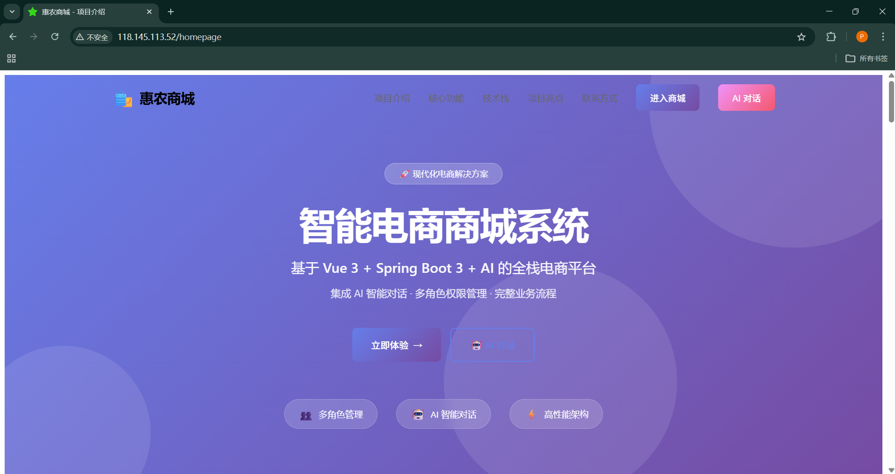
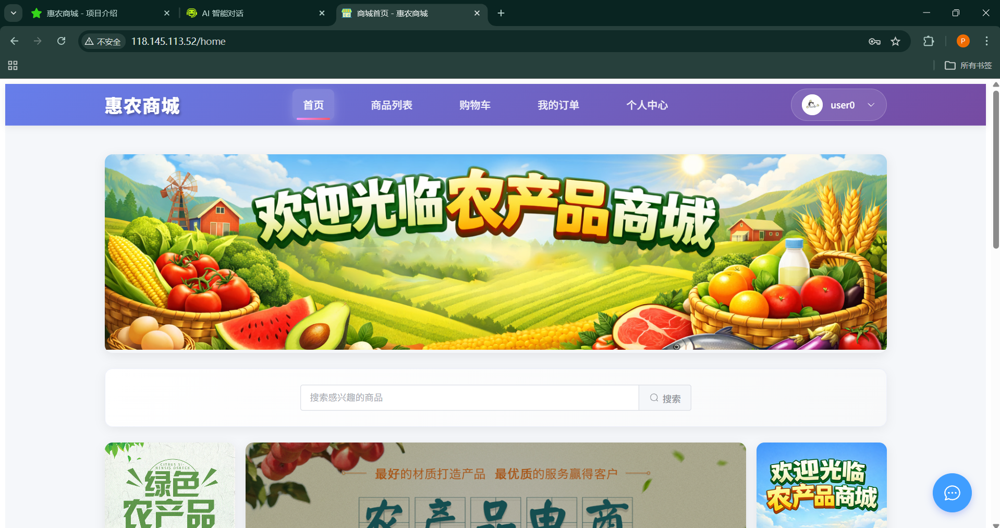
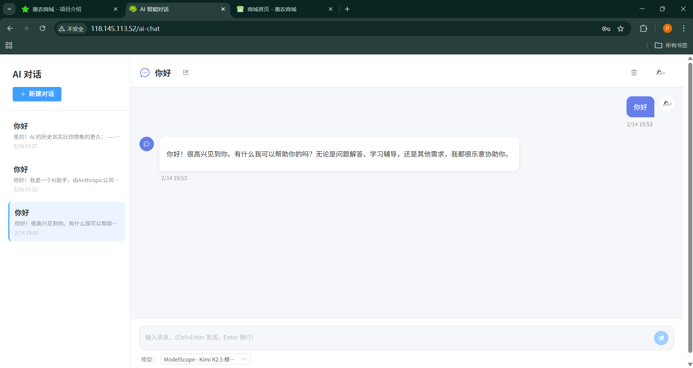
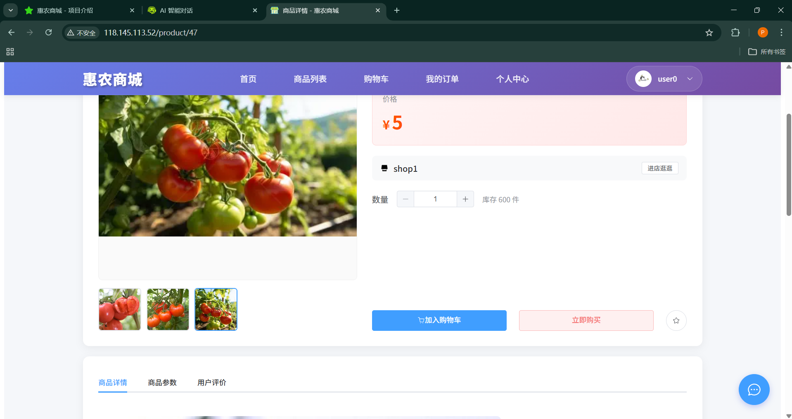
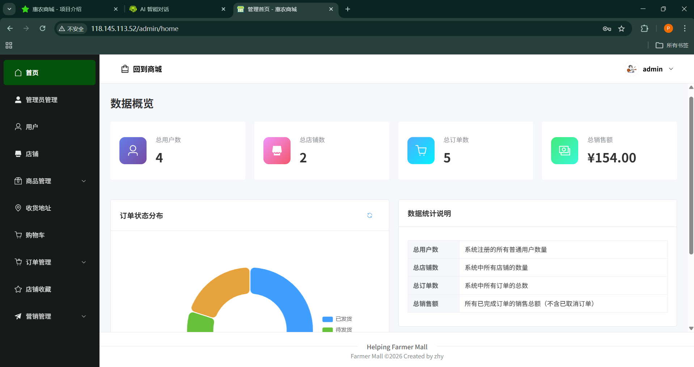

# 🛍️ 惠农商城系统 (Helping Farmers Mall)

<div align="center">


**基于 Vue 3 + Spring Boot 3 + Spring AI 的现代化全栈电商平台**

[功能特性](#-功能特性) • [技术栈](#️-技术栈) • [在线演示](#-在线演示) • [快速开始](#-快速开始) • [项目结构](#-项目结构) • [API 文档](#-api-文档)

</div>

---

## 📖 项目简介

助农商城系统是一个功能完整的现代化电商平台，采用前后端分离架构开发。项目最大亮点是集成了 **Spring AI 智能对话系统**，支持多 AI 服务商（ModelScope、Moonshot AI 等）动态切换，为用户提供智能化的购物咨询体验。

系统支持**用户购物、商家管理、平台管理**三种角色，实现了从商品浏览、购物车、下单支付到订单管理、数据统计的完整电商业务闭环。

> ⚠️ **重要声明**：
> - 本项目为毕业设计作品，目前尚未完成答辩
> - 当前仅开源**前端代码**部分，后端代码暂不公开
> - 答辩完成后将考虑开源完整项目代码
> - 在线演示地址可正常访问和体验所有功能

### ✨ 核心亮点

- 🤖 **AI 智能客服** - 集成 Spring AI 1.1.0，支持 DeepSeek V3.2、Kimi K2.5 等多模型，流式响应体验
- 🎨 **现代化技术栈** - Vue 3 Composition API + Spring Boot 3 + Java 21，使用最新稳定版本
- 👥 **多角色权限** - 用户、商家、管理员、超级管理员四级权限，JWT + 拦截器细粒度控制
- 📦 **完整业务流程** - 89+ RESTful API，涵盖商品、订单、支付、评价、收藏等全流程
- 📊 **数据可视化** - ECharts 图表展示，实时统计销售额、订单量、用户增长等数据
- 🚀 **高性能架构** - Redis 缓存 + 阿里云 OSS + MyBatis 分页，保证系统高性能
- 📱 **响应式设计** - Element Plus UI 组件库，适配多种设备，移动端友好
- 🔐 **安全可靠** - JWT Token 认证 + Redis 会话管理 + 参数校验 + 全局异常处理

---

## 🎯 功能特性

### 👤 用户端功能
- ✅ 用户注册、登录、个人信息管理、余额充值
- ✅ 商品浏览、搜索、分类筛选（支持热销、新品查询）
- ✅ 购物车管理（添加、修改数量、删除、批量操作）
- ✅ 订单全流程（创建订单、余额支付、取消订单、确认收货、商品评价）
- ✅ 收货地址管理（新增、编辑、删除、设置默认地址）
- ✅ 商品收藏、店铺收藏、浏览历史记录
- ✅ **AI 智能对话**（多模型切换、流式响应、对话历史、上下文记忆）

### 🏪 商家端功能
- ✅ 商家注册、登录、店铺信息管理
- ✅ 商品管理（发布商品、编辑、上下架、富文本详情编辑）
- ✅ 订单管理（查看订单、发货处理、物流信息填写）
- ✅ 店铺数据统计（销售额、订单量、商品销量排行）
- ✅ 商品分类管理

### ⚙️ 管理员功能
- ✅ 管理员登录、权限管理（普通管理员 + 超级管理员）
- ✅ 用户管理（查看、禁用/启用、重置密码、批量删除）
- ✅ 商家管理（审核、查看、禁用/启用、批量删除）
- ✅ 商品管理（审核、下架、批量删除）
- ✅ 订单管理（查看所有订单、处理异常订单、批量删除）
- ✅ 轮播图管理、广告管理、分类管理
- ✅ 平台数据统计（用户量、商家量、交易额、订单量趋势图）
- ✅ OSS 文件管理（查看、删除未使用文件）

---

## 🛠️ 技术栈

### 前端技术

| 技术 | 版本 | 说明 |
|------|------|------|
| Vue 3 | 3.5.22 | 渐进式 JavaScript 框架，使用 Composition API |
| Vite | 7.1.11 | 下一代前端构建工具，快速热更新 |
| Vue Router | 4.6.3 | 官方路由管理器，支持嵌套路由和路由守卫 |
| Pinia | 3.0.4 | Vue 3 官方状态管理库 |
| Element Plus | 2.11.8 | Vue 3 UI 组件库，中文语言包 |
| Axios | 1.13.2 | HTTP 客户端，配置拦截器处理 token |
| ECharts | 6.0.0 | 数据可视化图表库 |
| Tiptap | 3.13.0 | 现代化富文本编辑器 |
| Marked | 17.0.1 | Markdown 解析器 |
| Highlight.js | 11.11.1 | 代码语法高亮 |
| DOMPurify | 3.3.1 | HTML 内容安全过滤 |

### 后端技术

| 技术 | 版本 | 说明 |
|------|------|------|
| Spring Boot | 3.5.7 | Java 应用开发框架 |
| Java | 21 | JDK LTS 版本 |
| MyBatis | 3.0.4 | 持久层框架，使用 XML 映射 |
| MySQL | 8.0+ | 关系型数据库 |
| Redis | 6.0+ | 缓存数据库，用于 Token 存储 |
| JWT | 4.4.0 | JSON Web Token 认证 |
| Spring AI | 1.1.0 | Spring 官方 AI 集成框架 |
| Spring WebFlux | - | 响应式编程，支持 AI 流式响应 |
| 阿里云 OSS | 3.17.4 | 对象存储服务 |
| PageHelper | 1.4.6 | MyBatis 分页插件 |
| Lombok | - | 减少 Java 样板代码 |

---

## 🌐 在线演示

项目已部署到服务器，可以直接访问体验：

**访问地址**: [http://118.145.113.52](http://118.145.113.52)

> 💡 提示：
> - 首次访问可能需要等待几秒加载
> - 建议使用 Chrome、Edge 或 Firefox 浏览器访问
> - 可以使用下方提供的测试账号快速体验各个角色功能

---

## 🚀 快速开始

### 环境要求

- **Node.js**: 20.19.0+ 或 22.12.0+
- **JDK**: 21
- **MySQL**: 8.0+
- **Redis**: 6.0+
- **Maven**: 3.8+

### 1. 克隆项目

```bash
# 前端项目（已开源）
git clone https://github.com/VitixPavix/mall-frontend.git
cd mall-frontend
```

> 📌 **注意**：后端代码暂未开源，如需完整体验请访问在线演示地址

### 2. 数据库配置

```bash
# 1. 创建数据库
mysql -u root -p
CREATE DATABASE helping_farmers_mall CHARACTER SET utf8mb4 COLLATE utf8mb4_unicode_ci;

# 2. 导入数据库脚本
# 选择以下任一脚本导入：
# - backend/mall/helping_farmers_mall仅结构.sql（仅表结构）
# - backend/mall/helping_farmers_mall结构和数据.sql（表结构 + 测试数据）
mysql -u root -p helping_farmers_mall < backend/mall/helping_farmers_mall结构和数据.sql
```

### 3. 后端启动

```bash
cd backend/mall

# 修改配置文件 src/main/resources/application.yml
# 配置以下内容：
# - 数据库连接信息（url、username、password）
# - Redis 连接信息（host、port）
# - 阿里云 OSS 配置（endpoint、accessKeyId、accessKeySecret、bucketName）
# - AI API Key（可选，不配置则 AI 功能不可用）

# 启动后端服务
mvn spring-boot:run

# 或者使用 IDE（IDEA/Eclipse）直接运行 MallApplication.java
```

后端服务启动成功后，访问地址：`http://localhost:8081`

### 4. 前端启动

```bash
cd frontend/mall

# 安装依赖
npm install

# 启动开发服务器
npm run dev

# 构建生产版本
npm run build
```

前端服务启动成功后，访问地址：`http://localhost:5173`

---

## 🎮 快速体验

项目提供了测试账号，可以快速体验各个角色的功能：

### 商城登录页面

| 角色 | 账号 | 密码 | 说明 |
|------|------|------|------|
| 普通用户 | user0 | 123456 | 体验购物、下单、评价等功能 |
| 商户 | hhhhhh | 123456 | 体验商品管理、订单处理等功能 |
| 管理员 | admin1 | 123456 | 体验平台管理、数据统计等功能 |

### AI 对话登录页面

| 角色 | 账号 | 密码 | 说明 |
|------|------|------|------|
| 测试用户 | user0 | 123456 | 体验 AI 智能对话功能 |

> 💡 提示：登录页面提供"免注册快速体验"区域，点击即可自动填充测试账号

---

## 📁 项目结构

```
助农商城系统/
├── frontend/mall/              # 前端项目（Vue 3）
│   ├── public/                 # 静态资源
│   │   ├── 商店.svg            # 商城图标
│   │   ├── 在线客服.svg         # AI 对话图标
│   │   └── 项目.svg            # 项目介绍图标
│   ├── src/
│   │   ├── api/                # API 接口封装（17 个模块）
│   │   │   ├── user.js         # 用户接口
│   │   │   ├── product.js      # 商品接口
│   │   │   ├── order.js        # 订单接口
│   │   │   ├── aiChat.js       # AI 对话接口
│   │   │   └── ...
│   │   ├── assets/             # 资源文件（CSS、图片）
│   │   ├── components/         # 公共组件
│   │   │   ├── AiChat.vue      # AI 对话组件
│   │   │   └── ...
│   │   ├── router/             # 路由配置
│   │   │   └── index.js        # 路由定义
│   │   ├── stores/             # Pinia 状态管理
│   │   │   ├── token.js        # Token 状态
│   │   │   └── userInfo.js     # 用户信息状态
│   │   ├── utils/              # 工具函数
│   │   │   └── request.js      # Axios 封装
│   │   └── views/              # 页面组件（44+ 个页面）
│   │       ├── homepage/       # 项目介绍页
│   │       ├── index/          # 用户端页面（15 个）
│   │       ├── shop/           # 商家端页面（6 个）
│   │       ├── admin/          # 管理端页面（17 个）
│   │       ├── ai/             # AI 对话页面（2 个）
│   │       └── user/           # 用户中心页面（3 个）
│   ├── index.html              # HTML 入口
│   ├── package.json            # 依赖配置
│   └── vite.config.js          # Vite 配置
│
├── backend/mall/               # 后端项目（Spring Boot 3）
│   ├── src/main/
│   │   ├── java/org/springboot/mall/
│   │   │   ├── MallApplication.java        # 启动类
│   │   │   ├── anno/                       # 自定义注解
│   │   │   │   ├── RequireRole.java        # 角色权限注解
│   │   │   │   └── RequireSuperAdmin.java  # 超级管理员注解
│   │   │   ├── config/                     # 配置类
│   │   │   │   ├── MultiAiProviderConfig.java  # AI 多服务商配置
│   │   │   │   └── WebConfig.java          # Web 配置
│   │   │   ├── constant/                   # 常量定义
│   │   │   │   └── OrderState.java         # 订单状态枚举
│   │   │   ├── controller/                 # 控制器层（21 个）
│   │   │   │   ├── UserController.java     # 用户控制器
│   │   │   │   ├── ProductController.java  # 商品控制器
│   │   │   │   ├── OrderController.java    # 订单控制器
│   │   │   │   ├── AiChatController.java   # AI 对话控制器
│   │   │   │   └── ...
│   │   │   ├── dto/                        # 数据传输对象（40+ 个）
│   │   │   │   ├── common/                 # 通用 DTO
│   │   │   │   ├── UserDTO.java
│   │   │   │   ├── ProductDTO.java
│   │   │   │   ├── AiChatRequestDTO.java
│   │   │   │   └── ...
│   │   │   ├── exception/                  # 异常处理
│   │   │   │   └── GlobalExceptionHandler.java
│   │   │   ├── interceptor/                # 拦截器
│   │   │   │   ├── LoginInterceptor.java   # 登录拦截器
│   │   │   │   ├── RoleInterceptor.java    # 角色权限拦截器
│   │   │   │   └── SuperAdminInterceptor.java
│   │   │   ├── mapper/                     # MyBatis Mapper（15 个）
│   │   │   │   ├── UserMapper.java
│   │   │   │   ├── ProductMapper.java
│   │   │   │   ├── ConversationMapper.java
│   │   │   │   └── ...
│   │   │   ├── pojo/                       # 实体类
│   │   │   ├── service/                    # 业务逻辑层
│   │   │   │   └── impl/                   # 实现类
│   │   │   ├── task/                       # 定时任务
│   │   │   │   └── OssCleanupTask.java     # OSS 清理任务
│   │   │   └── utils/                      # 工具类
│   │   └── resources/
│   │       ├── application.yml             # 配置文件
│   │       └── mapper/                     # MyBatis XML 映射（15 个）
│   ├── pom.xml                             # Maven 配置
│   ├── API接口文档.md                       # API 文档（3228 行）
│   ├── 项目结构说明.md                      # 项目结构说明
│   └── helping_farmers_mall结构和数据.sql   # 数据库脚本
│
├── backend/md说明文档/          # 后端说明文档
│   ├── AI接口重构说明.md
│   ├── SpringAI迁移指南.md
│   ├── 商品管理API文档.md
│   └── ...
│
├── frontend/md说明文档/         # 前端说明文档
│   ├── API_PROXY_GUIDE.md
│   └── NGINX_DEPLOYMENT.md
│
└── README.md                   # 项目说明文档（本文件）
```

---

## 🗄️ 数据库设计

项目包含 17 张核心数据表：

### 核心业务表
- `user` - 用户表（用户名、密码、余额、状态等）
- `shop` - 商家表（店铺名、资质图片、粉丝数等）
- `admin` - 管理员表（用户名、密码、角色等）
- `product` - 商品表（名称、价格、库存、销量、详情等）
- `category` - 分类表（分类名称、备注）
- `cart` - 购物车表（用户ID、商品ID、数量）
- `order` - 订单表（订单号、总金额、状态、收货信息等）
- `order_item` - 订单明细表（商品信息、数量、评价等）
- `address` - 收货地址表（收货人、电话、地址、是否默认）

### 功能扩展表
- `product_collection` - 商品收藏表
- `shop_collection` - 店铺收藏表
- `browsing_record` - 浏览记录表
- `carousel` - 轮播图表
- `ad` - 广告表

### AI 对话表
- `conversation` - AI 对话会话表（会话标题、用户ID、创建时间）
- `conversation_message` - AI 对话消息表（会话ID、角色、内容、时间戳）

---

## 🔐 权限控制

系统采用 JWT + 拦截器实现细粒度权限控制：

### 角色定义
- `user` - 普通用户（购物、下单、评价）
- `shop` - 商家（商品管理、订单处理）
- `admin` - 管理员（平台管理、数据统计）
- `super_admin` - 超级管理员（管理员管理）

### 权限矩阵

| 功能模块 | 用户 | 商家 | 管理员 | 超级管理员 |
|---------|------|------|--------|-----------|
| 商品浏览 | ✅ | ✅ | ✅ | ✅ |
| 购物车 | ✅ | ❌ | ✅ | ✅ |
| 订单管理 | ✅（自己） | ✅（自己店铺） | ✅（全部） | ✅（全部） |
| 商品管理 | ❌ | ✅（自己） | ✅（全部） | ✅（全部） |
| 用户管理 | ❌ | ❌ | ✅ | ✅ |
| 商家管理 | ❌ | ❌ | ✅ | ✅ |
| 管理员管理 | ❌ | ❌ | ❌ | ✅ |
| AI 对话 | ✅ | ✅ | ✅ | ✅ |

### 权限实现
- **JWT Token**: 有效期 12 小时，存储在 Redis 中
- **自定义注解**: `@RequireRole`、`@RequireSuperAdmin`
- **拦截器链**: LoginInterceptor → RoleInterceptor → SuperAdminInterceptor
- **前端守卫**: 路由守卫 + Token 过期自动检测

---

## 📊 API 文档

项目提供完整的 RESTful API 文档，共 89+ 个接口：

### 接口模块
- **用户模块**: 6 个接口（注册、登录、信息管理、充值）
- **管理员模块**: 20 个接口（管理员管理、用户管理、商家管理）
- **商店模块**: 6 个接口（注册、登录、信息管理）
- **商品模块**: 6 个接口（CRUD、评论查询）
- **分类模块**: 6 个接口（CRUD、批量删除）
- **订单模块**: 10 个接口（创建、支付、发货、评价）
- **购物车模块**: 4 个接口（CRUD）
- **地址模块**: 4 个接口（CRUD）
- **轮播图模块**: 5 个接口（CRUD）
- **广告模块**: 3 个接口（查询、更新）
- **收藏模块**: 6 个接口（商品收藏、店铺收藏）
- **浏览记录模块**: 3 个接口（CRUD）
- **文件上传模块**: 2 个接口（单文件、批量上传）
- **统计模块**: 4 个接口（管理员统计、店铺统计）
- **AI 对话模块**: 4 个接口（对话、历史、服务商列表）

详细 API 文档请查看：[backend/mall/API接口文档.md](backend/mall/API接口文档.md)

---

## 🤖 AI 智能客服配置

项目集成了 Spring AI 1.1.0，支持多个 AI 服务商动态切换。

### 支持的 AI 服务商
- **ModelScope** - DeepSeek V3.2、Kimi K2.5
- **Moonshot AI** - Kimi 8K
- **OpenAI** - GPT-3.5、GPT-4（需配置 API Key）

### 配置方法

编辑 `backend/mall/src/main/resources/application.yml`：

```yaml
ai:
  providers:
    # ModelScope - DeepSeek V3.2
    modelscope-deepseek:
      api-key: your-modelscope-api-key
      base-url: https://api-inference.modelscope.cn
      model: deepseek-ai/DeepSeek-V3.2
      description: ModelScope - DeepSeek V3.2 模型
      temperature: 0.7
      max-tokens: 4000
    
    # Moonshot AI - Kimi
    moonshot-8k:
      api-key: your-moonshot-api-key
      base-url: https://api.moonshot.cn
      model: kimi-k2-turbo-preview
      description: Moonshot AI - Kimi 8K 模型
      temperature: 0.7
      max-tokens: 2000
```

### 功能特性
- ✅ 多服务商动态切换
- ✅ 流式响应（SSE）
- ✅ 对话历史管理
- ✅ 上下文记忆
- ✅ Markdown 渲染 + 代码高亮

---

## 🔧 配置说明

### 前端配置

**Vite 代理配置** (`frontend/mall/vite.config.js`)
```javascript
export default defineConfig({
  server: {
    proxy: {
      '/api': {
        target: 'http://localhost:8081',
        changeOrigin: true,
        rewrite: (path) => path.replace(/^\/api/, '')
      }
    }
  }
})
```

### 后端配置

**数据库配置** (`backend/mall/src/main/resources/application.yml`)
```yaml
spring:
  datasource:
    driver-class-name: com.mysql.cj.jdbc.Driver
    url: jdbc:mysql://localhost:3306/helping_farmers_mall
    username: root
    password: your_password
```

**Redis 配置**
```yaml
spring:
  redis:
    host: localhost
    port: 6379
```

**阿里云 OSS 配置**（需要自行申请）
```yaml
aliyun:
  oss:
    endpoint: your-endpoint
    accessKeyId: your-access-key-id
    accessKeySecret: your-access-key-secret
    bucketName: your-bucket-name
```

---

## 📸 项目截图

### 项目介绍页面


### 商城首页


### AI 智能对话


### 商品详情


### 管理后台


---

## 🌟 项目亮点

### 1. AI 智能客服系统 ⭐⭐⭐⭐⭐
- 集成 Spring AI 框架，支持多个 AI 服务商（ModelScope、Moonshot AI 等）
- 支持动态切换 AI 模型（DeepSeek V3.2、Kimi K2.5 等）
- 实现流式响应（SSE），提升用户体验
- 完整的对话历史管理，支持上下文连续对话
- 前端使用 Markdown 渲染和代码高亮，支持富文本展示

### 2. 完善的权限管理体系
- 基于 JWT 的无状态认证，Token 有效期 12 小时
- 多角色权限控制（user、shop、admin、super_admin）
- 自定义注解 + 拦截器实现细粒度权限控制
- 前端路由守卫配合后端权限验证
- Token 过期自动检测和清理

### 3. 高性能架构设计
- Redis 缓存提升查询性能
- 阿里云 OSS 实现图片存储和 CDN 加速
- MyBatis 分页插件优化大数据量查询
- 定时任务自动清理无用资源
- 响应式编程支持 AI 流式响应

### 4. 现代化前端架构
- Vue 3 Composition API 提升代码可维护性
- Pinia 状态管理实现数据持久化
- Element Plus 组件库提供统一 UI 风格
- ECharts 数据可视化展示业务数据
- Axios 拦截器统一处理请求和错误

### 5. 规范的代码结构
- 前后端分离，RESTful API 设计
- 后端三层架构（Controller → Service → Mapper）
- 统一的响应格式（Result、PageResult）
- 全局异常处理机制
- 完整的 API 接口文档（3228 行）

---

## 🔮 未来规划

- [ ] 支付功能集成（微信支付、支付宝）
- [ ] 秒杀活动模块
- [ ] 优惠券系统
- [ ] 物流跟踪功能
- [ ] 站内消息通知
- [ ] 商品推荐算法
- [ ] 移动端适配
- [ ] Docker 容器化部署

---

## 🤝 贡献指南

欢迎提交 Issue 和 Pull Request！

1. Fork 本仓库
2. 创建特性分支 (`git checkout -b feature/AmazingFeature`)
3. 提交更改 (`git commit -m 'Add some AmazingFeature'`)
4. 推送到分支 (`git push origin feature/AmazingFeature`)
5. 提交 Pull Request

---

## 📄 开源协议

本项目采用 [MIT](LICENSE) 协议开源

---

## 👨‍💻 作者信息

- **项目类型**: 毕业设计项目
- **开发时间**: 2025 - 2026
- **技术难度**: ⭐⭐⭐⭐（中高级）
- **开源状态**: 前端已开源，后端待答辩后开源

### 代码仓库

- **前端仓库**: [mall-frontend](https://github.com/VitixPavix/mall-frontend) ✅ 已开源
- **后端仓库**: 暂未开源（答辩后开放）

---

## 🙏 致谢

感谢以下开源项目：

- [Vue.js](https://vuejs.org/) - 渐进式 JavaScript 框架
- [Spring Boot](https://spring.io/projects/spring-boot) - Java 应用开发框架
- [Element Plus](https://element-plus.org/) - Vue 3 UI 组件库
- [ECharts](https://echarts.apache.org/) - 数据可视化图表库
- [Spring AI](https://spring.io/projects/spring-ai) - Spring 官方 AI 框架
- [MyBatis](https://mybatis.org/) - 持久层框架

---

## 📞 联系方式

如有问题或建议，欢迎通过以下方式联系：

- 📱 电话：+86 183 7969 1085
- 📧 邮箱：1296690048@qq.com
- 💻 GitHub：[VitixPavix](https://github.com/VitixPavix)

---

<div align="center">

**⭐ 如果这个项目对你有帮助，请给一个 Star ⭐**

Made with ❤️ by [VitixPavix]

</div>
